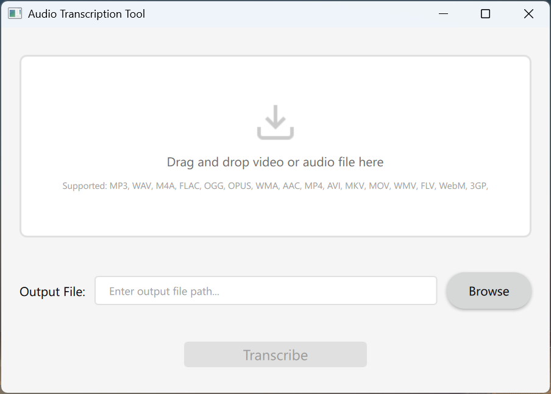

# TranscriberQt

An easy-to-use GUI to easily transcribe speech to text, either from videos or directly from audio files.

- **UI**: PySide6 using QML (Qt)
- **AI models**:
	- Speech recognition: **whisper**-large-v3-turbo ('deepdml/faster-whisper-large-v3-turbo-ct2'). Using `faster-whisper`.
	- Diarization (speaker recogniztion) models from pyannote, using `whisperx` package.

**How to use:**
1. Drag and drop your video or audio.
2. Choose the min and max number of speakers.
3. Click transcribe.
4. By default, the transcription text file will be located in the same folder as the original input file.

**Dependencies**:
- See `environment.yml` for a basic conda environment with all necessary dependencies including nvidia ones for GPU support.
- Use `environment-cpu.yml` if you don't have a nvidia gpu.
(`conda env create -f environment.yml`)

**How to run it**:
1. You need to create [a hugging-face READ token](https://huggingface.co/settings/tokens) and then accept these terms manually once:
	- https://huggingface.co/pyannote/speaker-diarization-3.1
	- https://huggingface.co/pyannote/segmentation-3.0
	- https://huggingface.co/pyannote/segmentation
2. Place your token on a .env file (HF_TOKEN=your_token)
3. Run `python main.py` inside `src` folder

TODOs:
1. Test on CPU-only platforms
