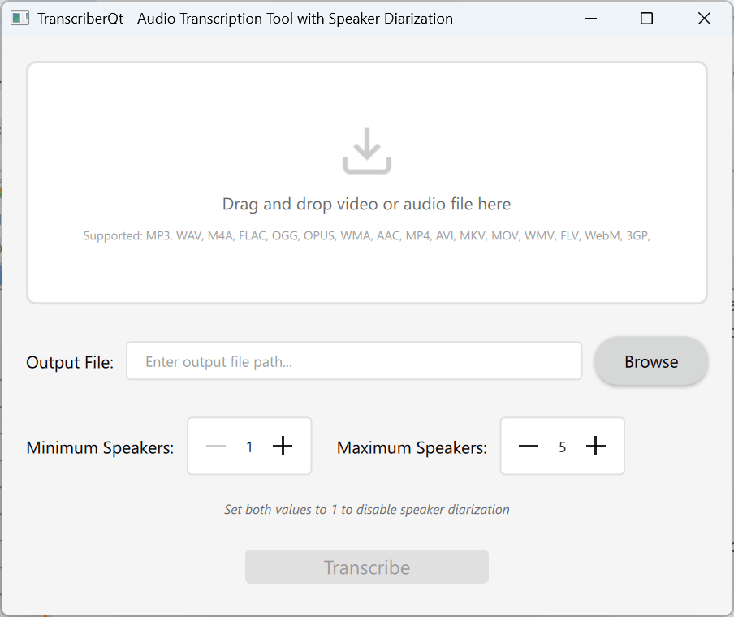

# Transcriber_qt

An easy-to-use GUI to easily transcribe speech to text, either from videos or directly from audio files.

Made using PySide6 (Qt) (mostly made with Claude.ai + some tweaks).

**How to use:**
1. Drag and drop your video or audio.
2. Click transcribe.
3. The transcription text file will be located in the same folder as the original input file.

**Dependencies**:
- See `environment.yml` for a basic conda environment with all necessary dependencies including nvidia ones for GPU support.
- Use `environment-cpu.yml` if you don't have a nvidia gpu.

**How to run it**:
- Run `python main.py` inside `src` folder.
